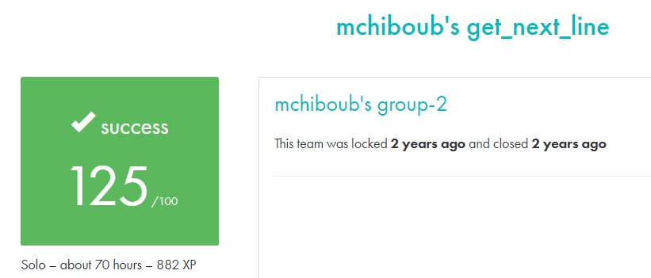

# GET_NEXT_LINE #

## What the project does: ##
This project, Get Next Line, involves creating a function get_next_line() that reads and returns a single line from a file descriptor each time it is called. It allows for reading through a file or standard input one line at a time.

## Why the project is useful: ##
The project is useful because it simplifies reading lines from files, a common and tedious task in C programming. Additionally, it introduces the concept of static variables, allowing for efficient management of state between function calls. This function is highly practical for processing large files or streams.

[Subject of this project](en.subject.pdf)